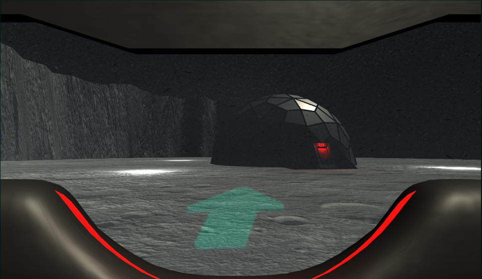

# Advanced Visualisation and Environments Project
This is my repository for my final project in the advanced visualisation and environments project.
### Motivation
From my project pitch I suggested two possible projects. The first actually came to me in a dream and featured four continuous scenes. Crossing the ocean in a boat to a lighthouse, jumping on the moon to a base, roaming through the desert into a temple, before finally travelling through a forest into a cabin. The idea centered around going through each of these scenes three times before finishing, each time with a subtle difference. I was drawn to the concept as I wanted to work on crafting realistic virtual environments as well as improve my limited modelling knowledge in Blender. 
\
\
The second suggestion was an attempt for people to be educated and/or understand mental health through interactive means. I wanted to explore the idea of evoking similar emotions and experiences felt by a person suffering from mental health problems. I considered a game might be perfect for this, not only because it is engaging, but because of the powerful immersion games can afford. With the right environment, you can be placed into the protagonists shoes and see completely from their perspective. This could prove useful, since - having myself and close friends deal with mental health issues in the past - I know it can be frustrating for friends and family to try and empathise and understand what the sufferer is going through, having not experienced these issues themselves. The game could be used as a tool to bridge this gap and hopefully provide help on both ends. With this forming the proposal, I gave little thought as to how it might be accomplished (the hard part). I initially aimed for as much abstraction and simplicity as possible: having just the player be a cube going through simple tasks. This would be an attempt to isolate the mental health aspect, for instance, having the cube reach a goal that progressively gets harder to reach before an easy task becomes impossible, such as with depression. Perhaps the colours could gradually become overwhelming to convey the experience of anxiety.
\
\
After getting feedback, my supervisor suggested combining the two ideas. I knew this would be a difficult task, since the mental health aspect had to be perfect and I couldn't hide behind abstraction, but instead create realistic scenes. It was paramount to me not to disrespect or trivialise my own or anyone elses mental health experiences. Consequently, I ensured sufficient research was carried out and applied with careful thought. 
\
\
Adding to this, it is important to state that that everyone experiences mental health differently. This project, or any other, can in no way encapsulate the entire range of emotions and feelings mental health causes.
### Inspiration
- Bioshock infinite
- Depression game
- Kerbal Space Program
- Limbo

### Process
Having suffered depression and anxiety, I decided to focus on these illnesses. In order to prevent myself considering my experiences as general, I asked many friends, who had dealt/are dealing with one or both, what their experiences were/are like. These were some of the most common words repeated across my observations. 
\
\
Depression: isolated, hopeless, unsatisfied, cold, tired, despair, endless, unrelenting, unfulfilment,
\
Anxiety: jarring, overwhelmed, uncontrollable, pressured, worry, hyper-aware, fight-or-flight, alienated
\
\
Following this qualitative analysis, I selected the ocean scene to represent depression. I often considered battling depression was similar to traversing a stormy sea. An ocean seems *endless* and the idea of the player battling turbulent waves could convey *hopelessness* and *despair*, whilst trying to reach an *ioslated* lighthouse with seemingly few amnetities, evoking a degree of *dissatisfaction*. For anxiety, I chose the moon scene. It was particularly difficult for me to devise a natural environment to represent anxiety (possibly because many of the discussions attributed anxiety to particularly artificial means, such as social media). As such, the moon seemed the most ideal to add these man-made pressures and distractions, through the perspective of science fiction. Having the player glide *uncontrollably* with each step in low gravity as their heads up display *overwhelms* them with information, pointing towards the base that contains the necessary oxygen which is *worryingly* running out.
#### Ocean Scene
For the ocean I forked [this](https://github.com/gasgiant/FFT-Ocean) excellent project. It uses compute shaders and Fast Fourier transforms to create a computationally inexpensive realistic body of water. 
<!--- PICTURE OF OCEAN --->
I will briefly explain how this works. Realistic wave patterns can be formed using Gerstner/Trochoidal waves. Gerstner waves are the waveform produced when each "node" oscillates about a circle. The waves feature increased authenticity when Gerstner waves with different parameters are summated. However, even if this were to be done through shaders, the computation quickly becomes expensive with large amounts of vertices - with a complexity of O(n^2). Using discrete FFTs to summate these waves drastically increases efficiency, with a complexity of O(nlogn). The vertices are calculated through compute shaders in this fashion, they are also rendered in cascades such that the quality/computation diminishes as you go further from the player camera.
\

\
I then needed the boat to be displaced according to the ocean vertices it rested on. Whilst I modelled everything else, I did not have time to model a boat so I used a free prefab from Unity's asset store. Additionally, the boats aesthetic was exactly how I imagined, and any attempt I made to replicate would be a poor mans copy. After spending considerable time understanding how the ocean worked, it was pretty easy to reverse engineer and extrapolate vertex heights at a given position. For realistic buoyancy physics, I created a script called Floater:
```
rigidBody.AddForceAtPosition(Physics.gravity/floaterCount, transform.position, ForceMode.Acceleration);
if(transform.position.y < waveHeight)
{
    float displacementMultplier = Mathf.Clamp01((waveHeight-transform.position.y) / depthBeforeSubmerged) * displacementAmount;
    rigidBody.AddForceAtPosition(new Vector3(0f, Mathf.Abs(Physics.gravity.y) * displacementMultplier, 0f), transform.position, ForceMode.Acceleration);
    rigidBody.AddForce(displacementMultplier * -rigidBody.velocity * waterDrag * Time.fixedDeltaTime, ForceMode.VelocityChange);
    rigidBody.AddTorque(displacementMultplier * -rigidBody.angularVelocity* waterAngularDrag* Time.fixedDeltaTime, ForceMode.VelocityChange);
}
```
This behaviour was tied to four empty game objects (floaters) under the boat object. These directly translated the effect of the water at each corner of the boat. I then added a controller which applied forces to the boat subject to WASD keys. There would also be logic to reset the boat to its initial position if it capsised. Below is a snippet of the code used to illustrate the realistic motion of the paddles:
```
private void rotateRightPaddle(float factor){
    t_r -= (Mathf.Abs(factor)/ factor)*Time.deltaTime;
    float x = Mathf.Abs(Mathf.Sin(t_r));
    float y = Mathf.Cos(t_r);
    float z = -Mathf.Sin(t_r);
    paddleRight.transform.localRotation = Quaternion.Euler(new Vector3(x*50, y*50 - 180, z*30));
}
```
The boat mechanics were almost complete. However, the water would render inside the boat which made the vessel seem like it was sinking. To fix this I added a depth mask to a clone copy of the boat, but upside down. This drew onto the depth buffer.
```
Shader "Masked/Mask" {
	SubShader {
		Tags {"Queue" = "Geometry+10" }
		// Don't draw in the RGBA channels; just the depth buffer
		ColorMask 0
		ZWrite On
		Pass {}
	}
}
```

\
Now that I was pleased with the motion, I needed to add the lighthouse. Having rarely used Blender to model before, I followed [this]() tutorial using below as the reference picture:
\

\
After I was happy with the lighthouse, I modelled some rocks. I subdivided a cube and applied a displacement modifier following a Voronoi texture. I also created a custom material with a geometry node to change its pointiness. These rocks were planned to be around the lighthouse, but when I translated them to unity, they lost their low polygon count as the modifiers were rasterised. As a result, I used rocks from the unity asset store instead, to keep the game lag-free.  
\


\
I found it difficult to properly translate the materials I made in Blender, so I re-made them in Unity. A seamless concrete texture (with normal maps) and a standard black material were applied to the lighthouse. I then modelled the dock and door. 
\


\
I modelled the door such that the inner door could be rotated around the hinges. There were a few teething problems:
\

\
After configuring the logic once the player gets to the dock, I added a spotlight with a simple volumetric shader and a spotlight source. I created a simple yellow gradient texture in photoshop and applied it to a modified cylinder made in blender. This rotated around the center of the lighthouse. Then I had to calibrate the wave settings for each subsequent level. Below are some pretty crazy waves generated from messing around in the settings:
\


#### Moon Scene
The main component in the moon scene was the realistic terrain generator. This would made using the summation of perlin noise waves with different degrees of detail (FM) and displacement (AM). I initially wanted to do this using a vertex shader, but I got into difficulty getting the vertex heights to the CPU. Whilst I could have fiddled around with a compute shader, being confined by time I decided to generate the mesh on the CPU - but in an efficient way. 
\


\
Programmatically I arranged an variable amount of vertices in a square grid. These could be scaled as well as altered in the settings. Each vertex y position was set to the height returned by the function below:
```
private float calculateHeight(float x, float z){
    x/=scale;
    z/=scale;        
    x += xSize * getXOffset();
    z += zSize * getZOffset();

    float low = Mathf.PerlinNoise(x*0.0051f, z*0.005f) * 60f * scale;
    float med = Mathf.PerlinNoise(x*0.1f, z*0.11f) * 3f * scale;
    float high = Mathf.PerlinNoise(0.3f*x, 0.31f*z) *scale;
    return low + med + high; 
}
 ```
To ensure the generation was efficient, I loaded the terrain in chunks. These were loaded in and out subject to where the player was standing, in such a way that the player was always in the middle chunk of a 5x5 grid. There were some issues lining these chunks up correctly:
\

\
By multiplying the size by the x,y offset of each chunk, the height variable was consistent. It took many attempts of trial and error to get the height formula to a standard I was happy with:
\

\
The next task was to ensure that the textures between chunks lined up correctly. I decided to add a custom surface shader that allowed you to scale the UV coordinates (which were just taken to be the vertex position). Whilst it wasn't perfect, it was much less noticeable than before. I also added functionality for a bump map.
\


\
Now that terrain was sorted, I needed to add the ability to control the player. I added a mesh collider to the terrain and a rigid body to the player, with reduced gravity. Logic was placed such that the player could only move if they were touching the ground. Next, I modelled a moon base and door in blender. These were then textured in Unity. 
\


\
Due to the varying altitudes of terrain I needed to find a way to ensure the base spawned on a flat surface. With the selected spawn chunk coordinates given by the level, I carved out a circular crater in that chunk, to allow a realistic bed for the moon base to rest on. 
\

\
There were some issues shading inside the crater, but I decided to leave the effect in (the bug becomes a feature yet again). This was because the sharp darkness gave an impression that the player was beginning to pass out; I wanted the player to believe that they were running out of oxygen at this stage of the level.     
\

\
After adding simple logic to deal with the players remaining oxygen, I needed a HUD to display this and other information. I modelled a simple set up in Blender and added it to unity under a new helmet layer with a new camera.
\

\
I created another camera for a UI layer, and targeted its output to a render texture. This was projected on the glass pane in front of the HUD. 
\


\
After fiddling for a bit, I got the arrow to correctly point at the base, as well as display the oxygen level and distance on the HUD. I also added a slight parrallax jiggle to the HUD glass and helmet, as well as a glass scratch bump map, to make the character seem more authentic.
\


### Walkthrough
There are currently three game modes to select from: both depression and anxiety, just depression, and just anxiety. These can be selected through the menu:
\

\
Clicking begin, you will play through both scenes alternatley whereas the other two plays through just one scene. There are three levels to each scene which, on completion, reverts back to the starting level. This was an artistic decision, in part to represent the fact that mental health conditions are ongoing - and can go through repeated cycles of intensity. As in most roads to recovery, there are relapses and cycles. Below is the scene shown when the player clicks "About":
\

#### Ocean Scene
A main intention of this scene was to convey a sense of unsatisfaction. I attempted to achieve this by making the ocean seem empty and vast with just one object: the lighthouse. It is not clear, at least at the start, what the purpose is to get to the lighthouse. With nothing else to do, the player is drawn to it. One could draw comparisons to a depressed person trying to find the purpose in everyday life, living on each day as if reaching their lighthouse. Not because they necessarily want to get there, but because they feel like there is nothing else to do, or that it is expected of them. Once the player arrives, there is meant to be little sense of accomplishment. As the levels progress, it becomes increasingly hard to reach this destination. A friend told me that during bad depressive episodes, straightforward tasks, such as getting getting out of bed and brushing their teeth, are often too demmanding. The levels behave this way to illustrate that insight; the same seemingly simple task of rowing to the lighthouse becomes deceptively difficult. Even after completing the hardest level, and gaining the most fulfillment, the scene quickly reverts back to the calm sea, reminding the player that people with depression often fail to recognise their accomplishments. The intermediate level also provides enough of a difficulty and understanding of the game mechanic, that once the hardest level loads, a sense of despair and hopelesness is intended to come over the player. Some people mentioned that their heads become slower when they are feeling depressed, so I included delay and momentum when looking around with the mouse, as well as pivoting around a slight offset, to represent not thinking with complete clarity. Finally, in all but the hardest level, the boat can remain stationary and not have to respawn (due to capsizing). This serves to show that when depression becomes so severe, the person dealing with it absolutely needs help/a force/push in order to stay above water. 
##### Level 1

\
Very calm sea, lighthouse is close by.
##### Level 2
Lighthouse is further away and waves are reasonably turbulent. Can capsise if the player is not careful.
##### Level 3

\
Waves are very tall and frequent. The player can barely see the lighthouse. The player will capsise.
##### The lighthouse

#### Moon Scene
For many people I asked, a big part of anxiety is how quickly it can uncontrollablely snowball. I attempted to translate that into the core movement mechanic of this scene. With zero gravity, impulsive forces, a small vertical component with each horizontal, and restricting movement to only when the player was on the ground, the player can quickly become hard to control. This is most prevalent when the player bounces off a hill with significant horizontal velocity, being unable to control yourself in the air at great speeds, like how many are powerless to their anxious thoughts carrying them away. Additionally, the mouse is particularly sensitive/responsive when looking around. It draws an interesting comparison to the ocean scene, where looking around is slow and sluggish but movement control is responsive, contrary to this scene, where looking around is responsive but movement is slow. This is to interpret anxiety as the mind moving too quickly (overthinking) even when life is moving quite slow. Critically to this scene, the player has to get to the moon base before their oxygen runs out. This is to replicate the intensity involved with anxious thoughts; one friend described anxiety as repeatedly being in a life or death situation. They would even feel this in safe environments, such as social settings. In a similar fashion to the ocean scene, the first level presents an easy task with no oxygen limit, but this quickly evolves into a particularly high pressured race for survival, suggesting the extent of the difficulties people with anxiety suffer in situations that most would not considered hard. The final and hardest level serves to describe a panic attack. The HUD becomes overwhelmed with information and bombarded with warning signs, before the arrow and distance scale go haywire, after oxygen levels pass below a threshold. Anxiety can be seen as a self fulfilling prophecy: when your thoughts race the most, when you need a clear head more than ever, your senses can go into overload which increases the intensity of the rate of thinking. This also aims to convey that when you are very anxious, it can be hard to trust your senses.
##### Level 1
Only the arrow on the HUD. The base is close by and there is no oxygen limit.
##### Level 2

\
Oxygen limit of 185 seconds, the base is further away but the player can reach it in some comfort. A warning sign and light on the HUD shines at 50% oxygen.
##### Level 3

\
Player has to traverse the terrain quickly as the base is very far away. After half the oxygen drops, arrow spins erratically and warning sign is shown, red light blinks. At 25% the distance reads an error and another warning sign is introduced, red light blinks quickly. The player will not make it the first time.
##### The moonbase

\
#### Youtube Video
[](https://www.youtube.com/watch?v=WCNnn20mysU)
#### Itch.io
To play the game click [here]()
### Evaluation
Whilst I am pleased with what I have created, I would not consider this work complete. Most clearly, a lot more focus was placed on the ocean/depression scene and it's aesthetic, compared to the moon/anxiety scene. This was due to being too ambitious with what I could achieve - and running out of time. There were many more snags along the way than I anticipated/allocated time for. This project reminded me how head-achey game development can be. Most importantly, however, this project lacks any sound. Sound is an incredibly useful tool in developing immersion. For this project to be complete, it would need sound. It is worth noting, I did hastily add sound but I took it out, as I didn't think it did the project justice and detracted from the overrall experience. 
\
\
Thinking back to the motivations, there were two main purposes of this project. The first, and less significant, was to improve my knowledge of Blender. Going from near zero experience, to modelling all but one model in the project, I feel that I satisfied this goal. The most important purpose for this work, however, was to give people accurate insights into the experience of those dealing with anxiety and depression. From my perspective, I believe that people could take something new away about mental health from this work. Even if it is that they don't understand it. As I have mentioned, it is very hard to understand the experiences of mental health if you have not experienced it yourself. Hopefully after implementing some of the future work, and collaborating with others, I might be able to say that it is even possible for people to understand these experiences through a game. I think perhaps I could have given the user more of an understanding had I followed a more abstract route, as I would have spent less time trying to make scenes as realistic as possible. Having combined my two initially suggested pitches, there were always going to be elements omitted from each specification. 
\
\
I asked some friends to playtest and they gave me decent feedback, mostly considering difficulty level and adjusting various mvoement parameters. One playtester particularly enjoyed the moon scene machanic and likenend it to a 3D version of tiny wings. However, in order to have a complete and thorough evaluation, I would need to ask more people (including both sufferers and non-sufferers of mental health issues) to play the game. 
### Future work
As aforementioned in the evaluation, work remains to be done before I am completely happy with this project. To begin, I would like to carry out more research from people suffering from mental health conditions - ideally in a more quantative manner. This time round I could gather data in the form of feedback from the game in its current state, as well as a more tailored survey asking questions before and after seeing the game. For added realism, I would also like to add some post processing and particle effects.
\
\
For the ocean scene I would like to add weather to add some pathetic fallacy - hopefully culiminating in a more somber mood. It was rather low down on my priorities and I ran out of time. Also, it was important to me the scene for depression wasn't classically sad - as most people deem depression to only be. In my mind, and others from discussions, depression manifests itself differently to sadness - but it is still a symptom. In this way, I would like to experiment with the weather. Additionally, I would like to improve the lighthouses beam of light, I feel it's simplicity detracts from the realness of the scene. Other minor changes would include an affect on the (currently non-existant) HUD, as the water aggressively crashes with the boat. The boat movement may also be improved, by allowing the water to inflict a horizontal force component, as opposed to just the vertical. The sound of this scene will eventually be waves crashing and possibly some background piano if I found the right track. I am not thinking of adding any bird sounds as I want the player to feel completely isolated. The wave sounds would get more intense as the levels progressed.
\
\
The moon scene, in my opinion, needs more work than the lighthouse scene in terms of realism. Perhaps adding some fog at the edges of the grid, or a more realistic light source could fix the rather artificial terrain. Additionally, I would like to replace the skybox with one that is more dynamic, maybe also including a sun with a lens flare. The crater in which the moon base spawns also looks very artificial, I plan to work on tapering the edges to a flat bed as opposed to suddenly changing to flat. Sound would dramatically improve this scene. I plan to add a heartbeat that increases in volume and tempo as the oxygen diminishes. There will also be various alarm sounds when the warning signs are displayed.
\
\
Finally, I would love to accomodate for other mental health conditions/disorders, such as bipolar disorder, schizophrenia, ADHD, and autism. Depending on the feedback, I would go through a similar process as with anxiety and depression. Ideally, adding VR functionality would complete the project - I believe this would the perfect medium to deploy and emulate these perspectives and experiences. Of course at this stage, the project would have to be heavily adapted with the possibility of a complete overhaul in the gameplay mechanics.  

