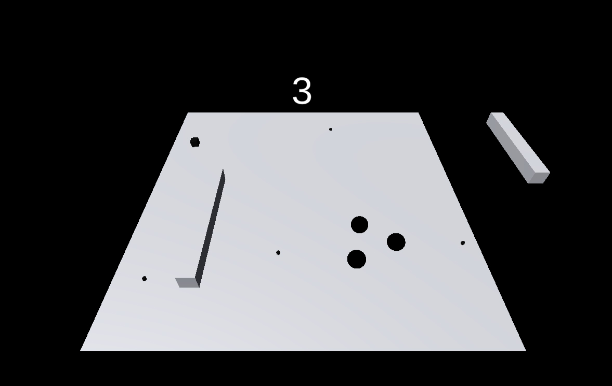

# Week 3: Roll-a-ball game

Following the tutorial [here](https://learn.unity.com/project/roll-a-ball) I successfully produced my first roll-a-ball game in unity. You can see the output of this tutorial [here](https://youtu.be/jg0K4wHOtDc). However, I decided to adapt and extend this as the final result was incredibly boring to play (it only had one level).

### Extended Roll-a-ball

#### Design
I played around with the affect of adding more than one ball to the scene and considered it could be a pretty cool game dynamic. As with all my games I prefer simplicity so I went with a base grayscale design, with minimal fancy 3D graphics. In fact, the player(s) appear to be 2D circles, with only their movement and the 3D obstacles giving away the perspective.

#### Gameplay
The game is a simple endless 3D platformer. Using the WASD keys you move the player towards the small rotating cube to gain points. There are also floating capsules that spawn with every new obstacle that, when triggered, spawn a new player on top of the previous one - effectively giving an extra life. Large cuboids are consistently spawned to sweep across the playing field in an attempt to knock off the player(s).
\
\
\
To play the game click [here](https://smithwrinch.itch.io/untitled-roll-a-ball-game)
To see the game in action click [here](https://youtu.be/ZR0GRcpX0EY)
