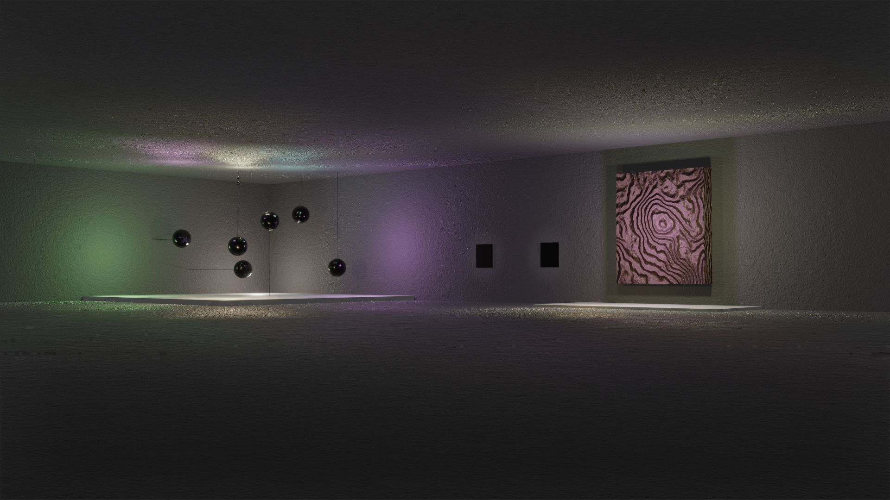
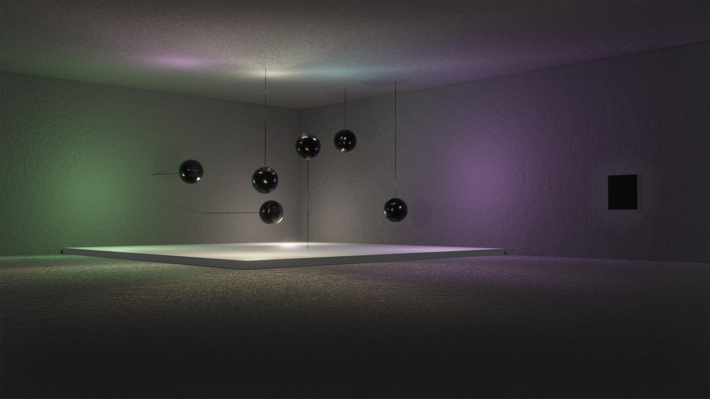
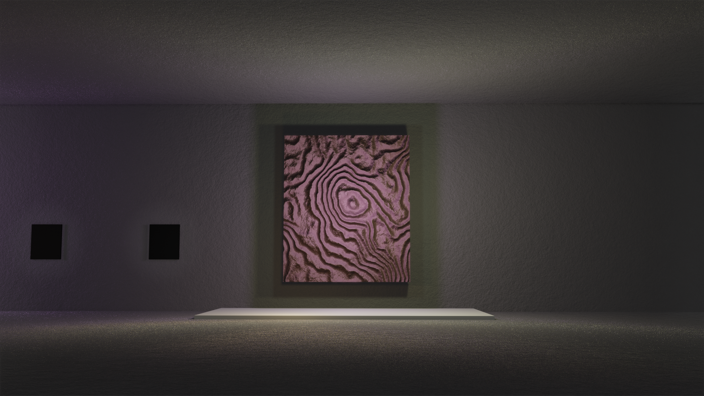

# Week 4 - Introduction to Blender/CGI Cinematography

Task: Produce a staged, cinematic gallery space in blender with dramatic lighting and composition.

### Balls on Strings

### Wall mount

To see the shader animation click [here](https://youtu.be/r1FB0VfnydA)