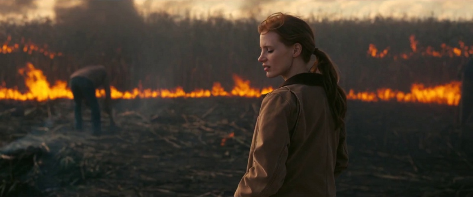
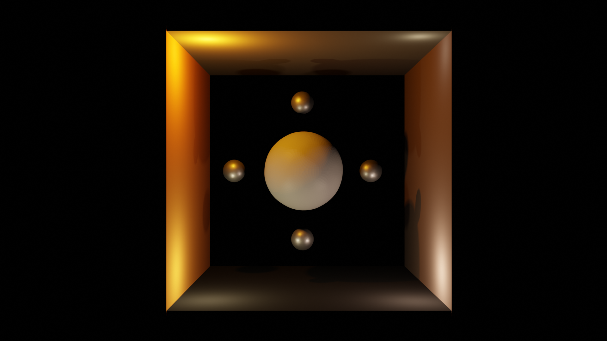
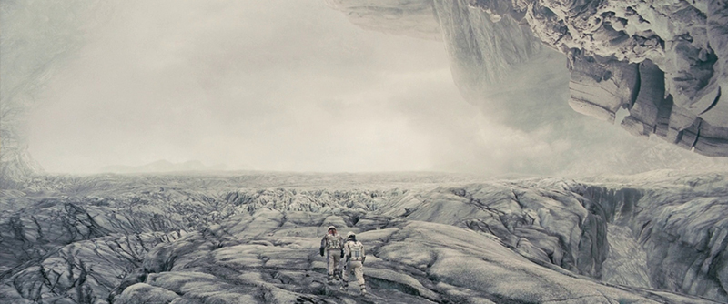
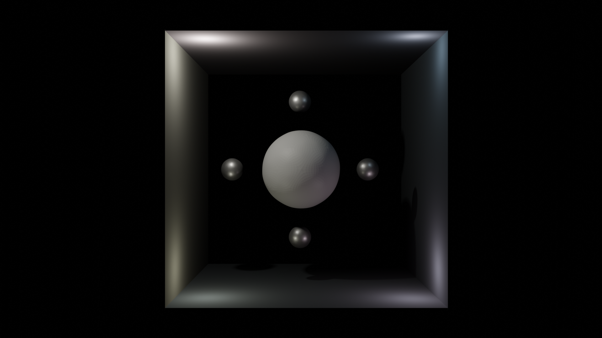
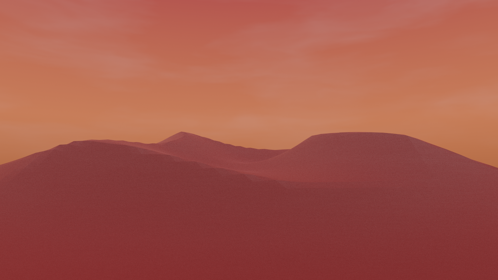

# Week 7 - Species of Spaces: investigating narrative & ideological environments with colour and sound
This week we looked at Brecht's A-effect and how it intentionally breaks immersion through the use of narration, sound, and lighting (V-effect). The task for this week was to explore colour scheme and lighting techniques to generate an environemntal mood.

### Part 1 - Analyse scenes from a movie/game with different emotional or dramatic emphasis
One of my favourite films is Nolan's interstellar so I opted to choose this for the task. 
#### Still 1
\

\
To me this scene conveys a sense of danger and despair. The fiery orange is in stark contrast to the dark and muted earthy tones which illustrate damage and discourse. 
\
\
My colour palette:
\

\
3D recreation:

#### Still 2
\

\
I think the colours here represent a feel of inhospitality and emptiness. The icy  light blue give an impression of an environment that is unwelcoming and the little variation in tone makes this environment seem vast and unnatural, encouraged through the slightest tint of earthy tones.
\
\
My colour palette:
\

\
3D recreation:

#### Evaluation of recreations
\
Having learned about the Cornell box (although this is primarily used to benchmark render engines) I made my own, consisting of 4 walls and 5 spheres. It gave a different effect to what I initially aimed for but I am pleased with the results. I thought omitting the back wall would bring focus on the colours and contents of the scene more but instead it supplied a darkness. It worked well for both of my gloomy scenes but I think a different backdrop would be necessary for happier/brighter scenes which kind of defeats the point of the Cornell box. It still gives off similar feels to my initial descriptions, however, so I will leave it like this.

### Part 2 - Create an environment that has a dramatic feel to it
I created a simple sand environment with two different colour schemes. The first gives me vibes of tranquil and calmness in a paradisical light blue sublty mixing with an earthly light brown. The second feels like etc.,...........
\

\

